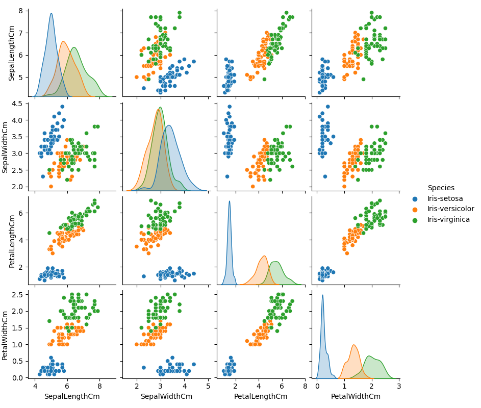

# pands-project
Repository for Programming and Scripting project analyzing the Iris Dataset.

# Background
The Iris Dataset is a dataset published by R.A. Fisher in 1936 [^1] . The data has been widely used for studying statistics and machine learning.

The iris dataset contains measurements on three species of iris flowers. The measurements are:
- Sepal length
- Sepal width
- Petal length
- Petal width

All measurements were taken in cm. In addition to the 4 measurements, the data also records the species of each entry.
There are a total of 150 data entries in the database. This is made up of 50 entries per species.

# Analysis
Assistance for initial exploratory analysis of the iris dataset can be found in multiple locations online [^2] [^3].

There are multiple sources to get the iris dataset online and there are some slight variations in the dataset depending on where it is acquired. The data itself should be unaltered in each source but some versions contain headings for columns, an ID column, or a number corresponding to the species (0, 1, or 2) [^2] [^4]. 

Initial analysis confirms the shape of the data (150, 5), meaning 150 rows of data and 5 columns. This is as expected having sourced the data from the UCI Machine Learning Repository [^1]. Using DataFrame.isnull() also confirms that there are no null values, so there is no missing data.

Running some initial statistical analysis using DataFrame.describe() show us the following broad information about the data:

| | Sepal Length (cm) | Sepal Width (cm) | Petal Length (cm) | Petal Width(cm) |
|---|---|---|---|---|
|Mean| 5.843 | 3.054 | 3.759 | 1.199 |
|Std| 0.828 | 0.434 | 1.764 | 0.763 |

These measures give us an indication of the dataset as a whole but as they include all species together they are of limited use in any functional analysis. The following breaks down the mean value information by species:
| | Sepal Length(cm) | Sepal Width (cm) | Petal Length (cm) | Petal Width (cm) |
|---|---|---|---|---|
| Iris Setosa | 5.006 | 3.418 | 1.464 | 0.244 |
| Iris Versicolor | 5.936 | 2.77 | 4.26 | 1.326 |
| Iris Virginica | 6.588 | 2.974 | 5.552 | 2.026 |

For a more visually informative version of the above information we can use a set of box plots to show differences across variables and species.

From the above plot we can see that across 3 out of 4 variables the Iris Setosa has the smallest measurements. This can be further visually confirmed by plotting the data on a set of scatterplots.

The above set of scatterplots reveal a very clear distinction between the Iris Setosa and the other two sepcies. This distinction is likely why the dataset has been so popular as a resource for machine learning initiates.
A further look at the scatterplots also shows that the data for the Iris Versicolor and Iris Virginica, while generally separate, has a degree of mixing across all variables.

When looking at the data it is also worthwhile to examine the spread of the data across each variable. This can be done visually by using histograms. The following histograms display the data for each species across the variables in the dataset:

Further investigation of the distribution of data within the dataset can be done by using scipy.stats.shapiro to check whether data is normally distributed [^5] [^6]. The results of normality tests run on the data are summarised below. This is displayed in a binary format below with Y representing normal distribution and N representing not normal distribution. Further information on specific p-value results from normality test can be found in the included iris_variable_summary.txt file.
| | Sepal Length | Sepal Width | Petal Length | Petal Width |
|---|---|---|---|---|
| All | N | Y | N | N |
| Setosa | Y | Y | Y | N |
|Versicolor | Y | Y | Y | N |
|Viriginica | Y | Y | Y | Y |

The above table uses the Shapiro method to calculate whether data is normally distributed. For quick assessment a visual inspection can also be done to see if data is likely to be normally distributed. Normally distributed data tends to have a common "bell-curve" shape. For visual inspection a kernel density estimate (KDE) plot can be useful [^3] [^7].
The following KDE plots generated using seaborn.kdeplot give a good representation of the spread of the data.

The above kernel density estimate plots portray the variation in data similarly to the previously used scatterplots. Of particular interest are the petal length and petal width KDE plots, showing Iris Setosa as completely separate from the other two species. Iris Versicolor and Iris Virginica can be seen to overlap across all variables.

Pairwise correlations can also be used to see if a change in one variable is likely to be a predictor of a correlated change in another variable. Below correlation heatmap shows the degree of correlation between variables:

In the above correlation heatmap the diagonal line going from top left to bottom right can be discounted. The correlation along that line is 1 as every variable of course correlates with itself.
A few interesting points on observing the correlation heatmap:
- Petal length and petal width are very highly correlated. This would seem to indicate that an increase in one is nearly always matched by an increase in the other (and vice versa).
- Sepal length has a large (although slightly lesser) correlation with both petal length and petal width.
- Sepal length and sepal width have very little correlation.
- Sepal width is somewhat negatively correlated with both petal length and petal width.
- Sepal width is not strongly correlated with any other variable. What correlation is there is a negative correlation (meaning as sepal width increases all other variable tend to decrease).

[^1]: https://archive.ics.uci.edu/ml/datasets/iris
[^2]: https://www.geeksforgeeks.org/exploratory-data-analysis-on-iris-dataset/
[^3]: https://medium.com/analytics-vidhya/exploratory-data-analysis-iris-dataset-4df6f045cda
[^4]: https://scikit-learn.org/stable/modules/generated/sklearn.datasets.load_iris.html
[^5]: https://docs.scipy.org/doc/scipy/reference/generated/scipy.stats.shapiro.html
[^6]: https://www.statology.org/normality-test-python/
[^7]: https://seaborn.pydata.org/generated/seaborn.kdeplot.html
